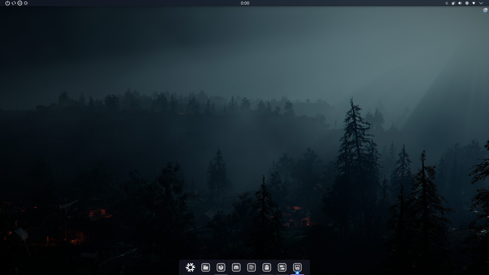

# Klean-Desktop-Environment
Named after KDE (K Desktop Environment)

### Consists
* 'Sweet KDE' Plasma Style
* 'Nothing' Window Decorations
* 'Midnight Sonata - Dark' Icon Pack
* 'Babita-Modern-Ice' Cursor (size 20)
* 'Ocean' System Sounds
* 'Watch_Dogs' Splash Screen

## Screenshot


## Panel and Dock settings
#### Panel (Top): 
* Thickness 20 
* Fill
* Always Vissible 
* Translucent
#### Panel items (left to right):
* Spacer (3px)
* 'Lock/Logout' Widget with Shutdown, Restart, Hibernate, Show logout screen
* Spacer (Flexible)
* Clock (24H, no date)
* Spacer (Flexible)
* 'System tray' Widget
* Spacer (3px)
#### Dock (Bottom)
* Thickness 40
* Fit Content
* Dodge Windows
* Translucent
#### Dock items (left to right):
* Application launcher with distro logo
* Icon only task manager

## How to add to your KDE
1. clone the repo and move it to your KDE themes folder
```bash
git clone https://github.com/SkyNixty/Klean-Desktop-Environment.git
mv 'Klean-Desktop-Environment/Klean desktop environment' ~/.local/share/plasma/look-and-feel/
kbuildsycoca6 --noincremental
```
2. Enable it in Sytem Settings > Colors & Themes > Global Theme
3. If anything is missing add it manually, components are under 'Consists'
